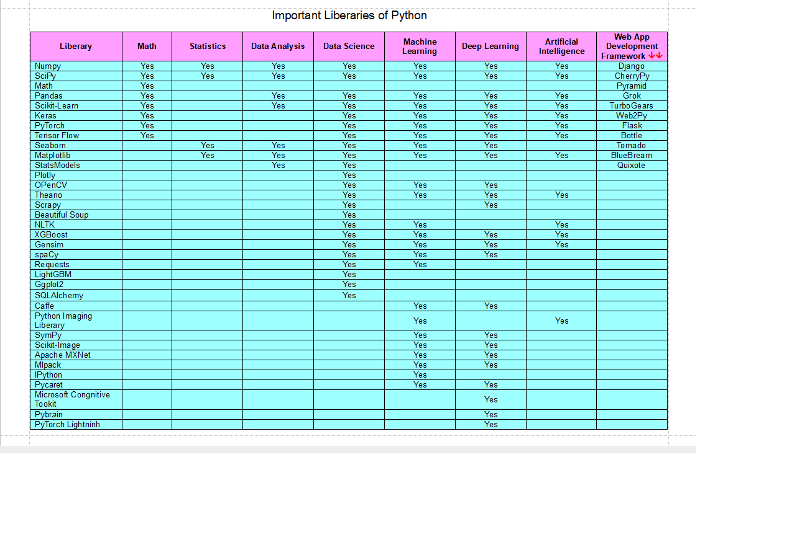

> # Day-1 Assignment
> ### *Which are the important extentions?*
 1. Blackbox AI Code Generation
 2. Excel Viewer
 3. JellyFix Theme
 4. Jupyter
 5. Jupyter Cell Tags
 6. Jupyter Keymap
 7. Jupyter Notebook Renderer
 8. Jupyter Slide Show
 9. Markdown
 10. Markdownn All in One
 11. Markdown
 12. Markdown Shortcuts
 13. Markdown Lint
 14. Pretttier
 15. Pylance
 16. Python
 17. Rainbow CV
 18. VSCode Icons
 19. VSCode PDF

> # Day-2 Assignmen-1
> ### *Types of AI*
1. Artificial Narrow Intelligence:  AI designed to complete concrete actions; unable to independently learn.
2.  Artificial General Intelligence:  AI designed to learn, think, and perform at similar levels to humans.
3.   Artificial Superintelligence:  AI surpasses humans' knowledge and capabilities.
4.   Reactive Machines:  AI capable of responding to external stimuli in real time; unable to build memory or store information for future.
5.   Limited Memory:  AI that can store and use knowledge to learn and train for future tasks.
6.   Theory of Mind:  AI that can sense and respond to human emotions, plus perform the tasks of limited memory machines.
7.   Self-awareness:  AI that can recognize others’ emotions, plus has sense of self and human-level intelligence; the final stage of AI.

> # Day-2 Assignment-2
> ### *Data Science vs Data Analysis*
> ### *Data Scientist vs Data Analyst*
1. *DataScience vs DataAnalytics:*
Both fields involve working with data to gain insights, **'data science'** often involves using data to build models that can predict future outcomes, while **'data analytics'** tends to focus more on analyzing past data to inform decisions in the present and for the future.

1. *DataScientist vs DataAnalyst:*
Data Analyst and Data Scientist are two career paths in big data.
The basic difference between the two is that a **'data scientist'** works to capture data while a **'data analyst'** tries to gain insights from that data.

> # Day-2 Assignment-3
> ### *Current Top Large Language Models (LLM) examples*
1. BERT
2. Claude
3. Cohere
4. Falcon 40B
5. Galactica
6. GPT-3, GPT-3.5, GPT-4
7. Language Model for Dialogue Applications (Lamda)
8. Large Language Model Meta AI (Llama)
9. Orca
10. Pathways Language Model (Palm)
11. Phi-1
12. StableLM
13. Vicuna 33B
For detail visit https://www.techtarget.com/whatis/feature/12-of-the-best-large-language-models

> # Day-3 Assignment-1
> ### *Which are important liberaries*

> # Day-3 Assignment-2
> ### *Which extention is best for which liberary*
