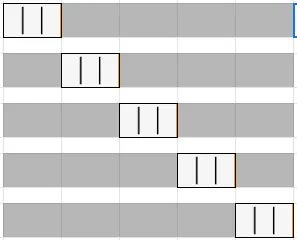

> # Day-1 Assignment
> ### *Which are the important extentions?*
 1. Blackbox AI Code Generation
 2. Excel Viewer
 3. JellyFix Theme
 4. Jupyter
 5. Jupyter Cell Tags
 6. Jupyter Keymap
 7. Jupyter Notebook Renderer
 8. Jupyter Slide Show
 9. Markdown
 10. Markdownn All in One
 11. Markdown
 12. Markdown Shortcuts
 13. Markdown Lint
 14. Pretttier
 15. Pylance
 16. Python
 17. Rainbow CV
 18. VSCode Icons
 19. VSCode PDF


> # Day-2 Assignmen-1
> ### *Types of AI*
1. Artificial Narrow Intelligence:  AI designed to complete concrete actions; unable to independently learn.
2.  Artificial General Intelligence:  AI designed to learn, think, and perform at similar levels to humans.
3.   Artificial Superintelligence:  AI surpasses humans' knowledge and capabilities.
4.   Reactive Machines:  AI capable of responding to external stimuli in real time; unable to build memory or store information for future.
5.   Limited Memory:  AI that can store and use knowledge to learn and train for future tasks.
6.   Theory of Mind:  AI that can sense and respond to human emotions, plus perform the tasks of limited memory machines.
7.   Self-awareness:  AI that can recognize others’ emotions, plus has sense of self and human-level intelligence; the final stage of AI.


> # Day-2 Assignment-2
> ### *Data Science vs Data Analysis*
> ### *Data Scientist vs Data Analyst*
1. *DataScience vs DataAnalytics:*
Both fields involve working with data to gain insights, **'data science'** often involves using data to build models that can predict future outcomes, while **'data analytics'** tends to focus more on analyzing past data to inform decisions in the present and for the future.

1. *DataScientist vs DataAnalyst:*
Data Analyst and Data Scientist are two career paths in big data.
The basic difference between the two is that a **'data scientist'** works to capture data while a **'data analyst'** tries to gain insights from that data.

> # Day-2 Assignment-3
> ### *Current Top Large Language Models (LLM) examples*
1. BERT
2. Claude
3. Cohere
4. Falcon 40B
5. Galactica
6. GPT-3, GPT-3.5, GPT-4
7. Language Model for Dialogue Applications (Lamda)
8. Large Language Model Meta AI (Llama)
9. Orca
10. Pathways Language Model (Palm)
11. Phi-1
12. StableLM
13. Vicuna 33B
For detail visit https://www.techtarget.com/whatis/feature/12-of-the-best-large-language-models


> # Day-3 Assignment-1
> ### *Which are important liberaries*


> # Day-3 Assignment-2
> ### *Which extention is best for which liberary*


> # Day-4 Assignment-1
>  ### *Extensions that are used for data analysis*

1. ***Python Indent:*** When you type a line of code and Enter, it will provide you with the correct Python indentation.
2. ***DVC Extension:*** Every data team depends on it to version the dataset for reproducibility purposes. DVC extension makes large file versioning simpler and easier.
3. ***Excel Viewer:*** Excel Viewer is a simple VS Code extension that previews Excel and CSV files on the IDE.
4. ***Data Wrangler:*** Data Wrangler can be used on any comma seperated value (.csv) data file or on any Pandas data frame in a Jupyter notebook.
5. ***SandDance for VSCode:*** Interactive data analysis tool for previewing data files to Visual Studio Code this extension can be used on any comma or tab separated value (.csv or .tsv) data file.


> # Day-4 Assignment-2
>  ### *Practise of miniconda commands from 'conda_cheatshee' file*

1. conda info : Run successfully 
2. conda update conda :  Run successfully
3. conda install python : Run successfully
4. conda update python : Run successfully
5. python --help : Run successfully
6. conda install --help : Run successfully
7. conda create --name eda : Created successfully
8. activate eda : Activated successfully
9. conda env list : Run successfully
10. conda create --clone eda --name eda2 : clone created successfully
11. conda list : Run successfully
12. conda list --revisions : Run successfully, 02 reviions found
13. conda install --revision 2 : Restore successfully
14. conda list --explicit > bio-env.txt : Saved sucessfully
15. conda env remove --name bio-env : Removed successfully
16. deactivate : Deactivated current enviroment successfully
17. conda list --explicit > bio-env.txt : Not run, SpecNotFound: Environment with requirements.txt file needs a name
18. conda create --name bio-env biopython : Enviroment created successfully
19. conda search python : Run successfully
20. conda install jupyter : Installed successfully
21. jupyter-notebook : Not run properly, show an error 'jupyter-notebook' is not recognized as an internal or external command,
operable program or batch file.
22. conda install --name bio-env toolz : Installed successfully
23. conda update python : Updated successfully
24. conda install --channel conda-forge boltons : Installed successfully
25. pip install boltons : Installed successfully
26. conda remove --name bio-env toolz boltons : Not installed, shows an error "PackagesNotFoundError: The following packages are missing from the target environment:
  - boltons"
27. conda create --name eda : Created successfully
28. activate eda : Run successfully
29. where python : Run successfully
30. python --version : Run successfully
31. conda remove --name bio-env --all : Deleted successfully
32. conda remove --name eda2 --all : Deleted successfully
33. conda remove --name eda --all : Deleted successfully


># Day4 Assignment-3
>### *How to activate miniconda in the terminal in vscode*
I search a lot but didn't find any solution for "how to activate miniconda in the terminal in vscode".


> # Day5 Assignment-1
> ### *Important libraries in Python are*
Numpy, SciPy, Math, Pandas, Scikit-Learn, Keras, PyTorch, Tensor Flow, Seaborn, Matplotlib, StatsModels, Plotly, OPenCV, Theano, Scrapy, Beautiful Soup, NLTK, XGBoost, Gensim, spaCy, Requests, LightGBM, Ggplot2, SQLAlchemy, Caffe, Python Imaging Liberary, SymPy, Scikit-Image, Apache MXNet, Mlpack, IPython, Pycaret, Microsoft Congnitive Tookit, Pybrain, PyTorch Lightning


> # Day5 Assignment-2
DMAS = Divide Multiplication Addition and Subtraction
PEMDAS = Parenthesis Exponent Multiplication Division Addition & Subtraction
BODMAS = Brackets Orders Division Multiplication Addition & Subtraction


> # Day5 Assignment-3
> ### *How to combine two or more comparison operators in one line of code*

x = 12
y = 4
print(x > y & y < x)


> # Day5 Assignment-4
> ### *Name and description of datatypes in python*
1. ***int:*** An Integer is a whole number starting from 1,2,3,4,5..... and so on
2. ***float:*** Floating numbers are decimal numbers like 1.1, 1.2, 1.3,...... and so on
3. ***complex:*** To store complex numbers (real and imaginary part) n=1+2j
4. ***bool:*** To store boolean values (True or False)
5. ***list:*** To store a sequence of mutable data l = [3, 'a', 2.5]
6. ***tuple:*** To store sequence immutable data t =(2, 'b', 6.4)
7. ***dict:*** To store key: value pair	d = {1:'J', 2:'E'} here 1&2 are keys and J&E are values
8. ***set:*** To store unorder and unindexed values	s = {1, 3, 5}
9. ***frozenset:*** To store the immutable version of the set	f_set=frozenset({5,7})
10. ***STring:*** String is a group of alphabets, numbers & special characters like 'abc@#123'
11. ***range:*** To generate a sequence of number	numbers for example range(10)
12. ***byte:*** To store bytes values,	b=bytes([5,10,15,11])

> # Day6 Assignment-1
> ### *Calculate BMI of a person by asking him to enter name, weight & height*

```# Calculating BMI (Body Mass Index)
# Taking input from user
name = input("Please enter your name : ")
weight = float(input("Please enter your weight (in kg) : "))
height = float(input("Please enter your height (in meters) : "))

# Calculate BMI
bmi = round((weight/height**2),2)

# Condition for checking criteria
if bmi <= 18.5:
    print(name, "You are underweight.")
elif 18.5 < bmi <= 24.9:
    print(name, "Your weight is normal.")
elif 25 < bmi <= 29.29:
    print(name, "You are overweight.")
else:
    print(name, "You are obese.")
```


> # Day6 Assignment-2
> ### *Deference between different data structures similarities and comparison*

| Data Structure | Order | Change | Duplicate | Access Through |
| :------------- | :---: | :----: | :-------: | :------------: |
| List           | Yes   | Yes    | Yes       | index          |
| tuple          | Yes   | No     | Yes       | index          |
| Dictionary     | Yes Python3.7  | Yes | Yes | Key            |
| Set            | No    | Yes    | No        | N/A            |


> # Day6 Assignment-3
> ### *5 example of for loop*
##### Example-1
```
word="miniconda"
for letter in word:
	print (letter)
```
##### Example-2
```
words= ["Ammar", "Tufail", "Shahid", "Umar" ]
for word in words:
	print (word)
```
##### Example-3
```
nums = (1, 2, 3, 4)
sum_nums = 0
for num in nums:
    sum_nums = sum_nums + num
print(f'Sum of numbers is {sum_nums}')
```
##### Example-4
```
for x in range(3):
    print("Printing:", x)
```
##### Example-5
```
nums = [1, 2, -3, 4, -5, 6]
sum_positives = 0
for num in nums:
    if num < 0:
        continue
    sum_positives += num
print(f'Sum of Positive Numbers: {sum_positives}')
```

> # Day6 Assignment-4
> ### *While loop inside for loop*
```
i = 0
kabab = ["chicken","garlic","cheese","tomato","lettuce","chilli"]    
print("Kababs are so good, this is what mine has:")
excitement_over_kabab = 1    

for ingredients in kabab:    
    while excitement_over_kabab == 1:
        print(kabab[i])
        i+=1
        if i == 6:
            print("Ok, my lunch requirement is fulfilled.")
            excitement_over_kabab = 0
```

> # Day7 Asignment-1
> ### *Recursive function in python*
```
def count_down(start):
    print(start) # Count down from a number
    # call the count_down from greater to lesser number
    next = start - 1
    if next > 0:
        count_down(next)
count_down(5)
```


> # Day7 Asignment-2
> ### *Define 10 function with lambda*
###### Function-1
```
welcome = lambda : print('Khush Aamdeed')
# Call the function
welcome()
```
###### Function-2
```
welcome = lambda name : print('Kese ho bhai,', name)
welcome('Shahid')
```
###### Function-3
```
add_one = lambda x: x + 1
add_one(2)
```
###### Function-4
```
add_string = lambda x: "Shahid " + "Umar"
add_string("Hi,")
```
###### Function-5
```
full_name = lambda first, last: f'Full name: {first.title()} {last.title()}'
full_name('Dr. Ammar', 'Tufail')
```
###### Function-6
```
# Anonymous function
# Means a function with name
(lambda x, y: x + y)(2, 3)
```
###### Function-7
```
(lambda x:
... (x % 2 and 'odd' or 'even'))(5)
```
###### Function-8
```
(lambda x, y, z=3: x + y + z)(1, 2)
```
###### Function-9
```
(lambda *args: sum(args))(1,2,3)
```
###### Function-10
```
a = lambda x, y : (x * y)  
print(a(5, 6))
```


> # Day7 Asignment-2
> ### *Types of Errors*
1. Indentation Error - Raised when there is an incorrect indentation.
2. Assertion Error - Raised when the assert statement fails.
3. EOF Error - Raised when the input() function hits the end-of-file condition.
4. Floating Point Error - Raised when a floating point operation fails.
5. Generator Exit - Raised when a generator's close() method is called.
6. Keyboard Interrupt - Raised when the user hits the interrupt key (Ctrl+c or delete).
7. Not Implemented Error - Raised by abstract methods.
8. OS Error - Raised when a system operation causes a system-related error.
9. Overflow Error - Raised when the result of an arithmetic operation is too large to be represented.
10. Reference Error - Raised when a weak reference proxy is used to access a garbage-collected referent.
11. Stop Iteration - Raised by the next() function to indicate that there is no further item to be returned by the iterator.
12. Tab Error - Raised when the indentation consists of inconsistent tabs and spaces.
13. System Error - Raised when the interpreter detects internal error.
14. System Exit - Raised by the sys.exit() function.
15. Unbound Local Error - Raised when a reference is made to a local variable in a function or method, but no value has been bound to that variable.
16. Unicode Error -	Raised when a Unicode-related encoding or decoding error occurs.
17. Unicode Encode Error - Raised when a Unicode-related error occurs during encoding.
18. Unicode Decode Error - Raised when a Unicode-related error occurs during decoding.
19. Unicode Translate Error	- Raised when a Unicode-related error occurs during translation.
20. Logical Error - A logical error occurs in Python when the code runs without any syntax or runtime errors
21. Runtime Error - Raised when an error does not fall under any other category.
22. Module Not Found Error - 
23. Syntex Error - Raised by the parser when a syntax error is encountered.
24. Name Error - Raised when a variable is not found in the local or global scope.
25. Type Error - Raised when a function or operation is applied to an object of an incorrect type.
26. Value Error - Raised when a function gets an argument of correct type but improper value.
27. Index Error - Raised when the index of a sequence is out of range.
28. Key Error - Raised when a key is not found in a dictionary.
29. Attribute Error - Raised on the attribute assignment or reference fails.
30. Zero Division Error - Raised when the second operand of a division or module operation is zero.
31. File Not Found Error - Raised when the file is not available on location or the file path is incorrect while importing a file.
32. Import/Export Error - Raised when the imported module is not found.
33. Memory Error - Raised when an operation runs out of memory.
34. Timeout Error - Raised system takes a lot of time to process an operation.

> # Day14 Assignment-1
> ### Google Play Store App EDA - Each Column of This Dataset is defined Below in .md style formate


 Column | Description |
| :----- | :---------- |
| App                   | Name of the application                                               |
| Category              | Category of Application e,g Family, Tools, Games, Business etc        |
| Rating                | Rating means experience score by the user, It's normally 1.0 to 5.0   |
| Reviews               | Feedback by the user, It's normally in the form of some text          |
| Size                  | This the size of application in MBs                                   |
| Installs              | How many people are downaloaded and install application on device     |
| Type                  | Free or Paid type of application                                      |
| Price                 | If it's paid then price will be mentioned here                        |
| Content Rating        | This rating consist Mature, Teen, Adult or Everyone etc               |
| Genres                | The genre which this app belongs e,g Entertainment, Tools etc         |
| Last Updated          | When was last time any update has been made for this app              |
| Current Ver           | Which version is currently available for download                     |
| Android Version       | Minimum android version required to run this app                     |


> # Day14 Assignment-2
> ### Make columns Size, Install & Price into numeric
- To numeric of Size column, first remove 'M' 'Kb' & 'Varies in device' values from Size column. Then convert this column into float
```
# Remove text 'Varies in device'
df['Size'] = df['Size'].replace('Varies with device', np.nan)

# Convert kilobytes to megabytes
def convert_size(size):
    if isinstance(size, float):
        return size
    elif 'k' in size:
        return float(size.split('k')[0]) / 1024
    else:
        return float(size.split('M')[0])
df['Size'] = df['Size'].apply(convert_size)

# Save the changes back to the CSV file
df.to_csv('google_playstore.csv', index=False)
```

> # Day15 is Off


> # Day16 has no assignment given


> # Day17 Assignment-1 
> ### Replace the respective missing values of ratig with respect of the averange given in each Installs_Category column
I didn't understand the assignment lecture will be watch again for correct the assignment


> # Day18 has no assignment given

> # Day19 Assignement-1
> ### What are the magic commands in Python
- IPython provides two categories of magics: `line magics` and `cell magics.`
  - Line magics operate on a single line of input and are denoted by a single percent sign (%).
  - Cell magics can operate on multiple lines of input and are denoted by two percent signs (%%).
- The pystata Python package provides three magic commands to interact with Stata from within the IPython environment: stata, mata, and pystata.
  - stata: Execute Stata commands
  - mata: Execute Mata code
  - pystata: Configure and display current system information


> # Day19 Assignement-2
> ### How many ways to format a string?
- Methode-1 (By % Operator)
```
"Hello, %s" % "Shahid"
```
- Methode-2 (String Formating)
```
'Hello, {}'.format('Shahd')
```
- Methode-3 (f-String)
```
a = 5
b = 10
f'Five plus ten is {a + b} and not {2 * (a + b)}.'
```
- Methode-4 (Templet String)
```
from string import Template
name = 'Shahid Umar'
t = Template('Hey, $name!')
t.substitute(name=name)
```


 # Day20 No Assignement Given
> ### Only blog reading and repeat quiz-3 exam


 # Day21 Assignement-1
> ### 10 Libraries for Data Visualizaiton in Python
1.  Pandas - For simple plots creation
2.  Matplotlib - For creating simple and advance plots of static, animated, and interactive visualisations.
3.  Seaborn - For creating attractive and informative statistical graphics, including scatter plots, line plots, bar plots, histograms, heat maps, regression plots, joint plots, and pair plots. 
4.  Plotly - For creating 3D Plots, dynamic dashboards and interactive web-based visualisations.
5.  Bokeh - For craating high-performance dynamic charts and graphs in several formats, including HTML and JavaScript.
6.  Plotnine - For creating wide range of geometric objects, themes, coordinate systems, and sizing options for appearance of their visualisations. 
7.  Geopandas - It provides read, edit, and update geographic data in several formats and perform geospatial operations, including spatial joins, geographical searches, and spatial aggregations.
8.  Basecamp - This library can convert coordinates into one of 25 alternative map projections.
9.  Pygal - Through this library, the graph may be edited, saved to a file, or displayed on a screen in a different way.
10. Folium - Produces interactive maps and shows geographical data.


# Day21 Assignement-2
> ### _Which Plot When Required for Data Visualization_


# Day21 Assignement-3
> ### *Make 10 different plots on different datasets each time using each of these four libraries.*
Assignment File Location : F:\Data Science By Ammar Tufail\6 Months DataScience and AI Mentorship Program\assignments\Day21_Assign3.ipynb


# Day22 Assignement-1
> ### *10 ways to make portfolio*
1. Tell a story for each service you provide
2. Leverage your portfolio creatively
3. Provide additional information for each portfolio item
4. Update your portfolio regularly to reflect your skills
5. Use Canva to make portfolio .html page
6. Create a github profile and upgrade it by uploading project files
7. Regular updates add skills and linkedin profile for making it as a portfolio
8. We can also make portfolio by facebook pages
9. Kaggle profile and dashboard is best for making data science portfolio
10. Match Portfolio and Investment/skill Objectives


# Day23 No Assignment
> ### *Only discussion lecture on Data Visualization blog*


# Day24 No Assignment
> ### *Only discussion lecture on seaborn and plotly ploting*\
> ### *15 important plots through plotly*


# Day25 No Assignment
> ### *Only Data Visualization quiz attampts of 30 questions*


# Day26 Assignment-1
> ### *How we can add more values when we hover the point on the plot*
```
import plotly.express as px
import seaborn as sns
tips = sns.load_dataset('tips')
fig = px.sunburst(tips, 
                  path=['sex','smoker', 'day', 'time'], 
                  values='size' , color='day',
                  hover_data=['size', 'tip', 'sex', 'smoker'])
                  # hover point on values
fig.show()
```


# Day26 Assignment-2
> ### *Animate graph using Monthly Data, convert the data into monthly data and then animated the plot, save it as avi and mp4 file or gif*
Assignment File Location : F:\Data Science By Ammar Tufail\6 Months DataScience and AI Mentorship Program\assignments\Day26_Assign2.ipynb


# Day27 Assignment-1
> ### *What are the ranges of standard scaling*
- Firstly, almost 68% comes in the range of -1 to 1
- Secondly, 95% of the whole data comes in the range of -2 to 2
- Lastly, 99.7% of data comes in the range of -3 to 3
### Note: ***When all the data transform in the range of -3 to 3 then we can say the whole data is almost in normalized condition***


# Day28 Assignment-1
> ### *Why do we have 1D, 2D & 3D array and where we need in Data Science?*
1.  `1D Array:` This is a single column value and is also called series data. I think It is also called a linear array. This type of array is used for lists.
2.  `2D Array:` This type of array has rows and columns in the data frame which shows that data can be represented horizontally as well as vertically. This type of array is used for tabular data.
3.  `3D Array:` This type of array has three dimensions one is horizontally representation second vertical representation of data and third is the data representation in depth. This type of array is best for drawing 3D plots.


# Day29 Assignment-1
> ### *What is the difference between int32, 64 ya float 32, 64, 16, 8, 4, 2, 1. In ka matlab kia hy? Why do we use one and not the other one?*

| Integer   | Description |
| :------:  | :---------- |
| 1-bit     | A 1-bit can store only two distinct values i,e 0 and 1 |
| 2-bit     | A 2-bit can store only four distinct values (0 to 3) |
| 4-bit     | A 4-bit can store sixteen distinct values (0 to 15) |
| 8-bit     | A 8-bit can store 256 distinct values (0 to 255) |
| 16-bit    | A 16-bit system can store 65,536 distinct values (0 to 65,535) |
| 32-bit    | A 32-bit system can store 4,294,967,296 distinct values (0 to 4,294,967,295) |
| 64-bit    | A 64-bit system can store 18,446,744,073,709,551,616 distinct values (0 to 18,446,744,073,709,551,615) |


# Day30 No Assignment Given
> ### *Today was off day only short lecture is uploaded*


# Day31 No Assignment Given
> ### *Today was off day only short lecture is uploaded*


# Day32 No Assignment Given
> ### *Today lecture was on matrix through numpy*


# Day33 No Assignment Given
> ### *Just read a blog and comment on it*
> For Blog link [click here](https://codanics.com/data-preprocessing-for-data-science/?unapproved=6960&moderation-hash=1c7a0368e778dd216a4180d85534757f#comment-6960)
### Table of Contents
1. Introduction
2. The "WH" Questions of Data Preprocessing
3. Data Cleaning
   - 3.1 Handling Missing Values
   - 3.2 Noise Reduction
   - 3.3 Outlier Detection
4. Data Transformation
   - 4.1 Normalization
   - 4.2 Standardization (Z-score normalization)
   - 4.3 Binning (Discretization)
   - 4.4 Feature Engineering:
5. Data Reduction
   - 5.1 Dimensionality Reduction:
   - 5.2 Feature Selection:
   - 5.3 Data Aggregation:
6. Data Discretization
7. Data Integration
   - 7.1 Data Concatenation:
   - 7.2 Entity Resolution:
   - 7.3 Feature Fusion:
8. Data Encoding
   - 8.1 Label Encoding:
   - 8.2 One-Hot Encoding & Ordinal Encoding:
9. Handling Imbalanced Data
10. Feature Scaling
11. Data Exploration
    - 11.1 Descriptive Statistics:
    - 11.2 Visualization:
12. Data Validation
13. Temporal, Text, Spatial, & Complex Data Handling
14. Data Anonymization, Versioning, Feedback Loop, and Schema Mapping
15. Example Code
    - Explanation of Each Part of the code:
16. Conclusion


# Day33 Assignment-1
> ### *Different mathematics definations with scientist names*
1. “Mathematics is the music of reason.” (Paul Lockhart)
2. “Mathematics is the poetry of the universe.” (Jonathan David Farley)
3. “Mathematics is the queen of the sciences.” (Carl Friedrich Gauss)
4. “Mathematics is the discipline dealing with nontrivial and interesting things.” (Jody Azzouni)
5. “All that is correct thinking is mathematics.” (Grigore Moisil)
6. “Mathematics is a game played according to certain simple rules with meaningless marks on paper.” (David Hilbert)
7. “Mathematics is the door and key of the sciences.” (Roger Bacon)
8. “Mathematics is the science of what is clear by itself.” (Carl Jacobi)
9. “Mathematics is as much an aspect of culture as it is a collection of algorithms.” (Carl Boyer)
10. “Mathematics is the art of giving the same name to different things.” (Henri Poincaré)
11. “Mathematics is the supreme judge; from its decisions there is no appeal.” (Tobias Dantzig)
12. “Mathematics is not a deductive science — that’s a cliché. When you try to prove a theorem, you don’t just list the hypotheses, and then start to reason. What you do is trial and error, experimentation, guesswork.” (Paul Halmos)
13. “Mathematics is the tool especially suited for dealing with abstract concepts of any kind and there is no limit to its power in this field.” (Paul Dirac)
14. “Mathematics is not only real, but it is the only reality.” (Martin Gardner)
15. “Mathematics is an art of human understanding.” (William Thurston)
16. “Mathematics is pure language — the language of science. It is unique among languages in its ability to provide precise expression for every thought or concept that can be formulated in its terms.” (Alfred Adler)
17. “Mathematics, however, is, as it were, its own explanation; this, although it may seem hard to accept, is nevertheless true, for the recognition that a fact is so is the cause upon which we base the proof.” (Gerolamo Cardano)
18. “Mathematics as an expression of the human mind reflects the active will, the contemplative reason, and the desire for aesthetic perfection. Its basic elements are logic and intuition, analysis and construction, generality and individuality.” (Richard Courant)
19. “Pure mathematics is, in its way, the poetry of logical ideas.” (Albert Einstein)
20. “As far as the laws of mathematics refer to reality, they are not certain; and as far as they are certain, they do not refer to reality.” (Albert Einstein)
21. “The true spirit of delight, the exaltation, the sense of being more than Man, which is the touchstone of the highest excellence, is to be found in mathematics as surely as in poetry.” (Bertrand Russell)
22. “Mathematics takes us still further from what is human, into the region of absolute necessity, to which not only the actual world, but every possible world, must conform.” (Bertrand Russell)
23. “Mathematics is, I believe, the chief source of the belief in eternal and exact truth, as well as a sensible intelligible world.” (Bertrand Russell)
24. “Mathematics is the most beautiful and most powerful creation of the human spirit.” (Stefan Banach)


# Day33 Assignment-2
> ### *What is the theory behind the zero?*
Zero is a fundamental concept in mathematics, and its theory is rooted in several branches of mathematics, including Number System, Arithmetic Operations, Algebraic Properties, Set theory, Calculus and limits, Number Theory.

Overall, It is a foundational concept in mathematics, providing a reference point, serving as an identity element, and enabling mathematical operations and calculations.

Zero is being used as a placeholder in a positional numeral system found in ancient Sumerian cuneiform texts from around 2000 BCE. Indian mathematicians, including Brahmagupta (598-668 CE) and Aryabhata (476-550 CE), described and discussed the properties and arithmetic operations involving zero in their works.


# Day33 Assignment-3
> ### *Write down a notebook for different branches of mathematics and their defination?*
This Assignment is available with name of 'Day34 Assign3.ipynb' in assignment folder.


# Day33 Assignment-4
> ### *What is triangular number?*
    - The triangular number sequence is the representation of the numbers in the form of equilateral triangle arranged in a series or sequence. These numbers are in a sequence of 1, 3, 6, 10, 15, 21, 28, 36, 45, and so on. 
    - In the pattern of triangular numbers you will see, the next number in the sequence is added with an extra row. Let us explain in detail.
      - First number is 1
      - In number 2,  a row is added with two dots to the first number
      - In number 3, a row is added with three dots to the second number
      - Again, in number 4, a row is added with four dots to the third number and so on
    - So the sequence formed here is in the pattern:
    - 1, 1 + 2, 1 + 2 + 3, 1 + 2 + 3 + 4,  and so on.
    - Triangular Number denoted by Tn = T1, T2, T3, T4, T5......
    - The formula of triangular number is 
      -  [n(n+1)]/2


# Day34 Assignment-1
> ### *Why number theory is known as queen of mathematics?*
- Because numbers are the foundational place in the discipline, Number theory is also called "The Queen of Mathematics".
  - Here are a few reasons why number theory has earned this title:
    - Pure and abstract nature
    - Long and rich history
    - Famous unsolved problems
    - Connections to other branches of mathematics
    - Applications in cryptography and security
  - The above factors collectively contribute to its reputation as a captivating and foundational discipline of number theory within mathematics.
  

# Day35 Assignment-1
> ### *How to find out Greatest Common Divisor (GCD) and Least Common Multiple (LCM)?*
>
    - For a set of two positive integers (a, b) we use the following steps to find the greatest common divisor:
        - **GCD of Two Numbers**
            - Let us see the steps given below to learn how to find the GCD of two numbers.

            - Step 1: Write the divisors of the number 'a'.
            - Step 2: Write the divisors of the number 'b'.
            - Step 3: List the common divisors of 'a' and 'b'.
            - Step 4: Now find the divisor which is the highest among the common divisors.
        
            - **Find the greatest common divisor of 13 and 48**
            - **Solution:** We will use the following steps to find the greatest common divisor of (13, 48).

            - Divisors of 13 = 1, and 13.
            - Divisors of 48 = 1, 2, 3, 4, 6, 8, 12, 16, 24 and 48.
            - The common divisor of 13 and 48 is 1.
            - The greatest common divisor of 13 and 48 is 1.
            - Therefore, GCD(13, 48) = 1

    - A common multiple of two numbers is a number that is a multiple of both numbers. Suppose we want to find common multiples of 15 and 20. We can list the first several multiples of each number. Then we look for multiples that are common to both lists—these are the common multiples.
        - **LCM of Two Numbers**
            - Find the LCM of 15 and 20 by listing multiples.
            - **Solution:**
              - List the first several multiples of 15 and of 20. Identify the first common multiple.
                - 15 = 15,30,45,60,75,90,105,120
                - 20 = 20,40,60,80,100,120,140,160
                - The smallest number to appear on both lists is 60, so 60 is the least common multiple of 15 and 20.
            - **Here we Notice** that 120 is on both lists, too. It is a common multiple, but it is not the least common multiple.


# Day35 Assignment-2
> ### *Define modulus, how to calculate modulus, which are its math equation, how to find mod of different numbers?*

- **DEFINATION**
  - The modulo (or "modulus" or "mod") is the remainder after dividing one number by another. Example: 14 mod 12 equals 2. Because 14/12 = 1 with a remainder of 2.
- **HOW TO CALCULATE 10 MOD 3**
  - a mod b an expression representing the remainder when we divide 'a' by 'b'
  - When we need to divide a number a/b then we find how many times 'b' fits into 'a'
  - It leftover is 'r' where o is less than or equal to 'r' and 'r' is less than or equal to 'b'
  - We see in the division problem "a/b = q reminder r", 'a' is the dividend 'b' is the divisor 'q' is the quotient 'r' is the reminder.
  - As per the above definition, 'a' divided by 'b' is equal to 'q' remainder 'r' then "a mod b equal r"
  - Frist divide 'a' by 'b' to find the remainder
  - Now 10 mod 3 remainder is 1, so we can say the modulus of 10 mod 3 is '1'
- **EQUATION OF MODULUS**
  - the equation of modulus is a mod b = reminder(r)
- **FIND MOD OF DIFFERENT NUMBERS**
  - 21 mod 9 = 3
  - 55 mod 10 = 5
  - 999 mod 8 = 7
  - 545 mod 33 = 17
  - 95 mod 7 = 4
  - 111 mod 10 = 1
  - 1000 mode 60 = 40
  - 250 mod 4 = 2
  - 334 mod 3 = 1
  - 700 mod 6 = 4
  - 886 mod 5 = 1
  - 1 mod 1 = 0
  - Online modulus generator of two number [link](https://www.mathsisfun.com/definitions/modulo-operation.html)

# Day35 Assignment-3
> ### *What is spelling and values of π?*
- The spelling of π is Pi
- In 2021, scientists at the University of Applied Sciences of the Grisons calculated another 31.4 trillion digits of the constant, bringing the total up to `62.8 trillion` decimal places. source [link](https://brainly.in/question/55862834)


# Day35 Assignment-4
> ### *Screenshots for table of number types*


# Day36 Assignment-1
> ### *Find unknown values by different methods of algebra?*

1. Find the squence by the following rules
   - Add 3 in next number              ( 1,3,6,9,12,..... )
   - Subract 0.1 starting from 10      ( 10, 0.9, 0.8, 0.7,....... )
   - Multipy by 4 to next number       ( 1,4,16,64,........ )
   - Divide by 2 of next number        ( 16,8,4,2,1,......... )
   - divible by 2 with remainder 1     ( 3,5,7,9,11,......... )

2. Solve the following algebric expressions when x=3 & y=2
   - x+y = 3+2 = 5
   - 10-x = 10-3 = 7
   - 5+4x = 5+4*3 = 5+12 = 17
   - 7x = 7*3 = 21
   - 4+5x = 4+5*3 = 4+15 = 19

3. Find the sum/subtraction of following expressions
   - (2x + 3y - 4z) + (3x - y - 4z) = 5x +2y -8z
   - (2x + 5y - 3z) - (3x + 4y - 2z) = -x + y - z
   - (x^2 - 2xy) - (4x^2 + xy - 3xy^2) = 3x^2 + 3xy - 3xy^2
   - (5x^2 - 8x + 4) + (3x^2 - 3x - 3 +xy) = 8x^2 - 11x + 1 +xy
   - 5x + 3y - 2x + 3y = 5x -2x + 3y + 3y = 3x + 6y

4. Simplify the following
   - 10x = 60 ==> x = 60/10 ==> x = 6
   - 20 - 2x = 0 ==> 20 = 2x ==> x = 20/2 ==> x = 10
   - x + 23 = 40 ==> x = 40 - 23 ==> x = 17
   - 4x < 180 ==> x < 180/4 ==> x < 45
   - x + x + 50 = 200 ==> 2x + 50 = 200 ==> 2x = 200+50 ==> x = 200/2 ==> x = 100

5. Find the division and multiplication of the following
   - 3x * 2y = 6xy
   - 3y * 5xy = 15xy^2
   - 10x / 2y = 5x / y
   - 5x^2 / 3xy = 5x / 3y
   - x^2 * y^2 / xy = xy 


# Day36 Assignment-2
> ### *What means the word al-jabr?*
In Arabic, "al-jabr" (الجبر) refers to the mathematical concept of algebra. The word "al-jabr" itself means `"reunion of broken parts" or "restoration."` The term was first introduced by the Persian mathematician Muhammad ibn Musa al-Khwarizmi in his influential book "Kitab al-Jabr wa al-Muqabala" (The Book of Restoration and Balancing), which was written in the 9th century.


# Day36 Assignment-3
> ### *Applications of Algebra in Data Science, Machine Learning and Artificial Intelligence*
1. **Data Manipulation:** Such as cleaning, preprocessing, and transforming data ike filtering, merging, aggregating, and joining datasets often involve algebraic operations like addition, subtraction, multiplication, and division.
2. **Linear Algebra:** Principal Component Analysis (PCA), Linear Regression Models, and Matrix Operations used in neural networks.
3. **Optimization:** Optimization algorithms like gradients, derivatives, and linear programming.
4. **Statistical Modeling:** Linear Regression, Logistic Regression involve algebraic equations that describe the relationship between variables insights from data.
5. **Matrix Operations:** Matrix operations, matrix multiplication, transpose, and inversion for Singular Value Decomposition (SVD), Clustering, Recommender systems, Deep Learning Architectures, Convolutional Neural Networks (CNNs) and Recurrent Neural Networks (RNNs).
6. **Graph Theory:** Graphs are fundamental structures used to model relationships and networks in data science and AI.
7. **Feature Engineering:** Polynomial features, interaction terms, and logarithmic transformations are used in feature engineering.
8. **Signal Processing:** These techniques enable the analysis, compression, and denoising of signals like image processing, audio processing, and speech recognition.
9. **Probability and Statistics:**  Probability distributions, statistical models, hypothesis testing, and estimation techniques.
10. **Recommender Systems:** Techniques like collaborative filtering and matrix factorization involve algebraic operations to analyze user-item interactions and compute similarity measures or latent factors.
11. **Natural Language Processing (NLP):** Techniques like vector space models, word embedding, and topic modeling 
12. **Time Series Analysis:** Autoregressive Models (AR), Moving average Models (MA), and Autoregressive Integrated Moving average Models (ARIMA).
13. **Reinforcement Learning:** It use algebraic operations to estimate and update the values of states and actions, enabling an agent to learn optimal policies through interaction with an environment.


# Day37 No Assignment Given, Just blog posting
> ### *[Algebra for Data Science and Machine Learning](https://codanics.com/algebra-for-data-science-and-machine-learning/)*
### Table of Contents
1. Introduction
    - 1.1 What is Algebra?
    - 1.2 Why is Algebra Important?
    - 1.3 How to Approach Algebra?
    - 1.4 Breaking it Down
2. Components of Algebra
3. Applications of Algebra in Data Science
    - 3.1 Vector and Matrix Operations
    - 3.2 Linear Regression
    - 3.3 Machine Learning Algorithms
    - 3.4 Dimensionality Reduction
    - 3.5 Eigenvalues and Eigenvectors
    - 3.6 Algorithm Efficiency
    - 3.7 Deep Learning
    - 3.8 Natural Language Processing (NLP)
    - 3.9 Clustering and Classification
    - 3.10 Image Recognition
4. Algebra and types
5. History of Algebra
    - 5.1 Ancient Origins (around 1900 BC)
    - 5.2 Egyptian Algebra (1650 BC)
    - 5.3 Islamic Golden Age (9th Century AD)
    - 5.4 Medieval Period (3rd to 7th Century AD)
    - 5.5 Renaissance (13th to 17th Century AD)
    - 5.6 Modern Era
6. Conclusion
    - 6.1 The Ultimate Zero-to-Hero Guide to Pre-Algebra
    - 6.2 Algebra for Data Science and Machine Learning
    - 6.3 Mastering the Art of Data Preprocessing
    - 6.4 Plotly python tutorial
    - 6.5 Data Visualization Quiz
    - 6.6 Data Visualization: Unlocking insights of Data
    - 6.7 Six months of AI and Data Science Mentorship Program
    - 6.8 Python ka Chilla for Data Science (40 Days of Python for Data Science)


# Day38a Below blog post reading
> ### *[The Ultimate Zero-to-Hero Guide to Pre-Algebra](https://codanics.com/the-ultimate-zero-to-hero-guide-to-pre-algebra/)*
### Table of Contents
1. Introduction
2. Chapter 1: Understanding the Basics of pre-algebra
   - 2.1 Numbers and Operations in algebra
   - 2.2 Key Terms in Algebra
3. Chapter 2: The World of Fractions and Decimals
   - 3.1 Simplifying Fractions
     - 3.1.1 Common Denominator in algebra
     - 3.1.2 Adding and Subtracting Fractions in algebra
     - 3.1.3 Multiplying and Dividing Fractions in algebra
     - 3.1.4 Mixed Numbers and Improper Fractions in algebra
   - 3.2 Decimals 
     - 3.2.1 Converting Fractions to Decimals
     - 3.2.2 Adding, Subtracting, Multiplying, and Dividing Decimals
     - 3.2.3 Rounding Decimals
     - 3.2.4 Decimal Places and Significant Figures
Chapter 3: The Power of Ratios and Proportions in algebra
Ratios
Writing and Simplifying Ratios
Equivalent Ratios
Proportions
Setting up Proportions
Solving Proportions
Direct Variation
Inverse Variation
Chapter 4: Mastering the Art of Percentages in Algebra
Understanding Percentages
Converting Fractions and Decimals to Percentages
Converting Percentages to Fractions and Decimals
Finding Percentages of Numbers
Percentage Increase and Decrease
Chapter 5: Unveiling the Mystery of Variables and Expressions in Algebra
Working with Variables
Understanding Variables
Algebraic Expressions
Simplifying Expressions
Solving Equations
One-step Equations
Two-step Equations
Multi-step Equations
Solving Inequalities
Graphing Inequalities
Compound Inequalities
Chapter 6: Measurement and Geometry Foundations
Units of Measurement
Length, Mass, Volume, and Time
Metric and Imperial Units
Unit Conversion
Introduction to Geometry
Points, Lines, and Angles
Triangles
Quadrilaterals
Circles
Perimeter and Area
Surface Area and Volume
Chapter 7: Data Analysis Basics in Algebra
Understanding Data
Collecting Data
Organizing Data
Descriptive Statistics
Mean, Median, Mode
Range
Interquartile Range
Probability
Simple Probability
Compound Events
Chapter 8: Pre-Algebra Problem Solving
Strategies for Problem Solving
Understanding the Problem
Devising a Plan
Carrying Out the Plan
Reviewing/Extending the Solution
Strategies for Problem Solving: A Concrete Example
Example Problem
Understanding the Problem
Devising a Plan
Carrying Out the Plan
Reviewing/Extending the Solution
Example questions for pre-algebra
Chapter 1: Understanding the Basics
Chapter 2: The World of Fractions and Decimals
Chapter 3: The Power of Ratios and Proportions
Chapter 4: Mastering the Art of Percentages
Chapter 5: Unveiling the Mystery of Variables and Expressions
Chapter 6: Measurement and Geometry Foundations
Chapter 7: Data Analysis Basics
Chapter 8: Pre-Algebra Problem Solving
Conclusion


# Day38b Assignment Solution of Excercise of below blog
> ### *The assignment file is available with name Day38_excercises_pre_algebra.ipynb*


# Day39 Assignment-1
> ### *How many decimal places we can use in calculations?*
The IEEE 754 provides different precisions, such as single precision (32 bits), double precision (64 bits), and extended precision (80 bits). These precisions correspond to roughly 7, 15, and 19 decimal places of accuracy, respectively.


# Day39 Assignment-2
> ### *What means PEMDAS/BODMAS and where can use it?*
PEMDAS = Parentheses Exponents Multiplication Division Addition Subtraction
BODMAS = Brackets Orders Division Multiplication Addition Subtraction

Both are commonly have same meaning, the common thing is that multiplication must be calculated first from addition and subtraction


# Day40 Assignment-1
> ### *Which are Matric and Imperial units?*
1. Units in matric system are:
   - Length: Meter (m), centimeter (cm), kilometer (km)
   - Mass: Gram (g), kilogram (kg), metric ton (t)
   - Time: Second (s)
   - Temperature: Celsius (°C)
   - Electric Current: Ampere (A)
   - Amount of Substance: Mole (mol)
2. Units in imperial system are:
   - Length: Inch (in), foot (ft), yard (yd), mile (mi)
   - Mass: Ounce (oz), pound (lb)
   - Time: Second (s)
   - Temperature: Fahrenheit (°F)
   - Volume: Fluid ounce (fl oz), pint (pt), gallon (gal)


# Day40 Assignment-2
> ### *Probability definition, types and one example*
1. Probability Definition
   - In simple word, probability means the chances measurement of occurrences from the total outcomes
2. Probability Types
   - Simple Probability
   - Classical Probability
   - Empirical Probability
   - Conditional Probability
   - Subjective Probability
   - Joint Probability
   - Marginal Probability
3. One Example of Probability
   - Most common example of probability is a fair of die which are the numbers 1, 2, 3, 4, 5, and 6. We consider that the number of favorable outcomes (odd numbers) and divide it by the total number of possible outcomes (six).
   - In this case, favourable outcomes (odd numbers) are 1,3,5
   - Now, the probability of rolling an odd number is 3/6 = 1/2 = 0.5 = 50%
   - So, we can say that favorable outcome for odd number is 50% when rolling a die each time.


# Day41 Assignment Elementary Algebra Exercises
> ### *[Elementary Algebra](https://codanics.com/elementary-algebra/)*
> ### The assignment file is available with name Day41_elementary_algebra.ipynb


# Day42 No Assignment Given
> ### *Only vector and vector spaces discussion in lecture*


# Day43 Now Assignment given - today is off
> ### *Task given to learn linear algebra from Khan Academy*


# Day44 Assignment-1
> ### *What is the defination of Cartesian Coordinates?*
Numbers that indicate the location of a point relative to the origin point. It is also known as rectangular coordinates, a system representing points in a two-dimensional or three-dimensional space.


# Day44 Assignment-2
> ### *Graph for linear dependence*


# Day44 Assignment-3
> ### *Is cross-product possible for 2D vector?*

- No, in two-dimensional space, cross-product is not defined for vectors because the cross-product is only for 3D vector space.
- By cross-product, we get a new vector as the result of the multiplication of two 3D vectors whereas when we multiply (by using the dot-product method) 2D vectors then it gives us scalar value only.


# Day45 Assignment-1
> ### *In matrix multiplication is M1.M2 = M2.M1 and A(BC) = (AB)C?*
I proved that M1.M2 is not equal to M2.M1 and A(BC) is not equal to (AB)C\
see in images\


# Day46 No ssignment but task
> ### *Complete Matrix inverse and system of equations from Khan Academy*
> #### [Link-1](https://www.khanacademy.org/math/algebra-home/alg-matrices/alg-intro-to-matrix-inverses/e/determine-inverse-matrices)


> # Day47 Assignment-1
> ### *Is AA^-1 = I true or not?*


> # Day47 Assignment-2
> ### *Example of Singular Matrix*
The singular matrix is that matrix whose determinant is equal to zero\


> # Day47 Assignment-3
> ### *Different Methods of solving of system of equations*
The file is save in assignment folder with name "Methods of System of Equations.docx"

> # Day48 Assignment
> ### *Solving of System of Equation by Different Mathematical Methods*


> # Day49 Assignment
> ### *What is eigenvector and eigenvalues?*
1. An eigenvector of a square matrix A is a non-zero vector v such that when A operates on v, the resulting vector is a scalar multiple of v. In other words, the eigenvector v remains in the same direction (up to scaling) after the matrix transformation. Mathematically, it can be represented as:

  - A * v = λ * v

Here, A is the matrix, v is the eigenvector, and λ (lambda) is the corresponding eigenvalue.

2. The eigenvalue λ is a scalar that represents the scaling factor by which the eigenvector v is stretched or compressed. Each eigenvector has a corresponding eigenvalue, and a matrix can have multiple eigenvectors with corresponding eigenvalues.

To find the eigenvectors and eigenvalues of a matrix, we solve the characteristic equation:

  - det(A - λI) = 0

Where A is the matrix, λ is the eigenvalue, and I is the identity matrix.

The solutions to the characteristic equation yield the eigenvalues of the matrix. Substituting each eigenvalue back into the equation (A - λI) * v = 0 and solving for v gives the corresponding eigenvectors.

Eigenvectors and eigenvalues have various applications, such as in diagonalization, understanding the behavior of linear transformations, analyzing stability in dynamical systems, and solving systems of linear differential equations. They provide valuable insights into the properties and behavior of matrices and linear transformations.

> # Day74 Assignement-1
> ### *How many types of feature encoding are ther?*
1. One-Hot Encoding
2. Label Encoding
3. Ordinal Encoding
4. Binary Encoding
5. Count Encoding
6. Target Encoding
7. Hashing Encoding
8. Feature Embedding
9. Frequency Encoding
10. Helmert Encoding
11. Polynomial Encoding
12. Backward Difference Encoding
13. Leave-One-Out Encoding
14. Feature Hashing
15. Entity Embedding


> # Day74 Assignement-2
> ### *When to use which type of feature encoding?*
1. **One-Hot Encoding:** Suitable when the categories are not ordinal and there is no inherent order or hierarchy among them.
2. **Label Encoding:** Suitable when the categories have an ordinal relationship or hierarchy.
3. **Ordinal Encoding:** Suitable when the categories have an ordinal relationship or hierarchy, and preserving that order is important.
4. **Binary Encoding:** Suitable for high-cardinality categorical variables when one-hot encoding would result in a high number of dimensions.
5. **Count Encoding:** Suitable when the frequency of a category is informative or when the count of occurrences is relevant.
6. **Target Encoding:** Used for categorical variables in classification problems. Suitable when encoding the relationship between the categories and the target variable is desired.
7. **Hashing Encoding:** For categorical variables, especially high-cardinality ones. Suitable when a fixed-length representation is needed and memory efficiency is important.
8. **Feature Embedding:** Commonly used in natural language processing tasks. Suitable when capturing semantic relationships between categories is important.
9. **Frequency Encoding:** Suitable when the frequency of a category is informative, and the actual count of occurrences is not necessary.
10. **Helmert Encoding:** Suitable when the categories have an ordinal relationship, and capturing the differences between successive categories is important.
11. **Polynomial Encoding:** Used for categorical variables with an ordinal relationship. Suitable when capturing the nonlinear relationship between categories is important.
12. **Backward Difference Encoding:** Used for categorical variables with an ordinal relationship. Suitable when capturing the differences between adjacent categories is important.
13. **Leave-One-Out Encoding:** Suitable when encoding the relationship between categories and the target variable, while avoiding leakage, is desired.
14. **Feature Hashing:** Used for both categorical and numerical variables. Suitable when dealing with high-dimensional, high-cardinality datasets, and memory efficiency is important.
15. **Entity Embedding:** Used for categorical variables with high cardinality, such as user IDs or product IDs. Suitable when capturing the relationships and similarities between entities is important.

# My Practice on first ML Model
While practicing on the simple linear regression model created in yesterday's lecture (Day-74), the model responded as shown in the picture which means that when '*total bill*' decreases gradually then the tip % will increase and when '*total bill*' increases then the tip % will be reduced. **Yani k gharibo pe zulam....**
The code is 

```
# The prediction model code
myinput = 500
myoutput = model.predict([[myinput]])
percent_tip = (myoutput*100)/myinput
print(myoutput)
print(percent_tip)
```

I think this model required more robustness

| Total_Bill | Tip | %_of_tip |
| :--------: | :-: | :------: |
| 500 | 52.39 | 10.47% |
| 400 | 42.11 | 10.53% |
| 300 | 31.83 | 10.61% |
| 200 | 21.55 | 10.77% |
| 100 | 11.27 | 11.27% |
| 80 | 9.21 | 11.52% |
| 60 | 7.15 | 11.93% |
| 40 | 5.10 | 12.75% |
| 20 | 3.04 | 15.23% |
| 10 | 2.01 | 20.19% |
| 5  | 1.50 | 30.11% |
| 3 | 1.30 | 43.33% |
| 2 | 1.20 | 59.86% |


> # Day75 No Assignement Given
> ### *Only Lecture regarding linear regression has been discussed*


> # Day76 Assignement
> ### *Why logistic regression is the problem of classification?*
The term **"regression"** in logistic regression refers to the underlying mathematical technique used to estimate the parameters of the model e,g Probability Interpretation, Logistic Function, Decision Boundary, Maximum Likelihood Estimation.
Moreover, logistic regression is a widely used algorithm for binary classification due to its simplicity, interpretability, and effectiveness in estimating probabilities and defining decision boundaries.


> # Day77 Assignement-1
> ### *What are different matrices of `regression` and `classification`?*
1. ### Regression Matrices
   - **MSE:** The Mean Squared Error function computes the residual sum of squares, a risk metric corresponding to the expected value of the squared (quadratic) error or loss.
   - **MAE:** The Mean Absolute Error (MAE) is the average variance between the significant values in the dataset and the projected values in the same dataset.
   - **RMSE:** The Root Mean Squared Error (RMSE) is one of the two main performance indicators for a regression model. It measures the average difference between values predicted by a model and the actual values. It estimates how well the model can predict the target value (accuracy).
   - **R2:**  R^2 (coefficient of determination) is a regression score function. Its possible score is 1.0 and it can be negative. A constant model that always predicts the average y disregarding the input features would get an R^2 score of 0.0.
2. ### Classification Matrices
   - **Accuracy Score:** The function returns the subset accuracy in multilabel classification. If the entire set of predicted labels for a sample strictly matches the true set of labels, then the subset accuracy is 1.0; otherwise, it is 0.0.
   - **Precision Score:** The precision is the ratio {tp / (tp + fp)} where `tp` is the number of `true positives` and `fp` is the number of `false positives`. The precision is intuitively the ability of the classifier not to label as positive a sample that is negative. The best value is 1 and the worst value is 0.
   - **Recall Score:** The recall is also the ratio {tp / (tp + fn)} where `tp` is the number of true positives and `fn` is the number of `false negatives`. The recall is intuitively the ability of the classifier to find all the positive samples. The best value is 1 and the worst value is 0.
   - **F1 Score:** The F1 score can be interpreted as a harmonic mean of precision and recall. Its best value at 1 and its worst score at 0. Moreover, F1 can be calculated for binary, micro, macro, weighted, and samples.
3. **Confusion Matrix:** The confusion_matrix function evaluates classification accuracy by computing the confusion matrix with each row corresponding to the true class. The confusion matrix can be normalized in 3 different ways: 'pred', 'true', and 'all' which will divide the counts by the sum of each column, row, or the entire matrix, respectively.
4. **Classification Report:** A classification report is a performance evaluation metric in machine learning. It is used to show the accuracy, precision, recall, and F1 Score, and provides a better understanding of the overall performance of our trained model.


> # Day77 Assignement-2
> ## *Why often use random_state=42 ?*
The number "42" itself does not hold any inherent significance but number "42" is often used as a placeholder or default value for random_state, you can use any integer value for random_state.
The important aspect is to use a fixed value consistently throughout your code. Moreover, the random_state parameter is used in various algorithms and functions that involve randomness or random number generation.


> # Day77 Assignement-3
> ## *Create SVR model on any dataset, I choose 'tip' dataset*
The assignment file save with name Day77_assign3_svr.ipynb


> # Day78 Assignement-1
> ## *Calculate the Minkowski Distance when P=1 (Manhattan Parametric Value)*


> # Day78 Assignement-2
> ## *What is p-value and how this value comes in the context of Minkowski Distance calculation?*
1. **P-Value**
   - In the context of the Minkowski distance, the parameter "p" refers to the order or power parameter and "p" is the parameter that determines the order or power of the Minkowski distance. The value of "p" can be any positive real number.
2. **P-Value Occurrence**
   - In this context, the parameter "p" is typically predefined and set by the user. It is not calculated from the data itself but rather provided as input to the distance calculation. The choice of the "p" value depends on the problem at hand and the desired characteristics of the distance metric
   - When p = 1 then it is Manhattan distance parametric value as an input
   - When p = 2 then it is Euclidean distance parametric value as an input


> # Day78 Assignement-3
> ## *When will we use Euclidean Distance and when will Manhattan Distance exactly?*
  - It's depends on the nature of the data and the specific requirements of the problem.
1. **Euclidean Distance (L2 Distance)**
   - Euclidean distance is commonly used when the dimensions are continuous and the assumption of equal importance for each dimension is reasonable.
   - It is suitable for problems where the concept of straight-line distance
   - Euclidean distance is sensitive to differences in all dimensions, including both large and small differences.
   - It is widely used in clustering, k-nearest neighbors (KNN), and optimization algorithms.
2. **Manhattan Distance (L1 Distance)**
   - It is suitable when movement is restricted to vertical and horizontal paths.
   - It is commonly used for datasets with categorical or ordinal features, or when the dimensions have different units or scales.
   - It is used in the blocked shaped distance calculation
   - It is often used in recommendation systems, image processing, and in problems where the concept of "blocks" or "steps" is relevant.
   - Manhattan distance is less sensitive to outliers since it does not consider the squared differences
   - Manhattan Distance can be computationally efficient to calculate compared to Euclidean distance, especially in high-dimensional spaces.
- The choice between Euclidean distance and Manhattan distance is not always clear-cut, and it may require experimentation and evaluation to determine which distance metric performs better for a specific problem.


> # Day79 Assignement-1
> ## *Design own example and calculate the values of Entropy, Gini Impurity and Information Gain*
The assignment file save with name Day79_assign1.ipynb


> # Day79 Assignement-2
> ## *Make a Notebook for Decision Tree Regressor on dataset with creteria checked and show its graphs*
The assignment file save with name Day79_assign2.ipynb


> # Day80 No Assignement Given
> ## *Discussion about Ensemble Methode or Algorithms*


> # Day81 Assignement (Machine Learning)
> ## *Make hand on regression diagram and calculate all the regression metrics*


> # Day82 Assignement (Machine Learning)
> ## *Draw an example of confusion metrics and calculate the values for accuracy, precision, recall (TPR or Sensitivity), F1 Score, Error Rate, FNR (Miss Rate), TNR (Specificity) and FPR*


> # Day83 No Assignement Given
> ## *Discussion about Ensemble Methode of Boosting algorithm and its detail overview*


> # Day84 Assignement-1 (Machine Learning)
> ## *Read the chart of boosting algorithm (which discussed at time stamp from 07:35 to 10:00 mints) for 10 minutes and point out error(s), if any*

In my understanding, the following errors are pointed out to me
1. Adaptive Boosting year is 1996 instead of 1995
2. Tochastic Gradient Boost is proposed by Freund and Schapire in 2004
3. XGBoost was introduced by Tianqi Chen in 2014 instead of in 2016
4. The correct year for LightGBM is 2016 instead of 2017


> # Day84 Assignement-2 (Machine Learning)
> ## *Can ensemble algorithms compete the neural networks?*

Yes, ensemble algorithms can compete with neural network algorithms and achieve competitive performance in various machine learning tasks through ensemble methods such as random forests, gradient boosting, XGBoost, and AdaBoost. The choice between ensemble algorithms and neural networks depends on factors such as the nature of the problem, available data, computational resources, interpretability requirements, and individual algorithm performance on specific tasks.

Moreover, Ensemble algorithms combine multiple individual models to make predictions or decisions. Each model, often referred to as a base learner, is trained on subsets of the data or with different algorithms. The ensemble then aggregates the predictions from the base learners to produce a final prediction. This aggregation can be done through techniques like majority voting, weighted voting, or averaging.

Here are the different solutions that can be acquired through ensemble algorithms:

1. `**Interpretability:**` Ensemble methods often provide insights into feature importance and model contributions. For example, random forests can rank features based on their importance, making them useful for feature selection or understanding the underlying relationships in the data.

2. `**Improved Generalization:**` Ensemble algorithms excel at generalization. They can capture diverse patterns and relationships in the data, leading to better performance on unseen examples. Ensemble methods can effectively reduce both bias and variance, improving the model's overall predictive ability.

3. `**Model Diversity:**` Ensemble algorithms benefit from model diversity, meaning that the base learners in the ensemble should be different from each other. This can be achieved by using different training subsets, different algorithms, or different hyperparameters. Model diversity helps to capture different aspects of the data and reduce the risk of overfitting.

4. `**Robustness:**` Ensemble methods can handle noisy or incomplete data better than individual models. By combining multiple models, they can reduce the impact of outliers or errors in the training data.

5. `**Performance:**` Ensemble methods can achieve higher performance than individual models. They can combine multiple models to create a more accurate and robust model.

6. `**Shape of dataset:**` Ensemble methods can work well with small size of datasets but neural networks algorithms can work well with large datasets.


> # Day84 Assignement-3 (Machine Learning)
> ## *Test the different algorithms on `diamonds` dataset, compare the results and verify which model is best and why?*

In my PC the winner is XGBoost model because:-
1. Its accuracy, precision, recall, and F1 Scores are higher than other models
2. Its computational time is greater than the decision tree model but increases all scores by 9%.
3. It's best because XGBoost also uses the `GPU` along with `CPU` for processing whereas sciket-learn uses the `CPU` only.


> # Day85 Assignement (Machine Learning)
> ### *What is catboost and which are assumption of catboosting?*
1. `CATBOOST`
   - CatBoost is a high-performance algorithm for gradient boosting on decision trees. Yandex researchers and engineers developed it. It is used for search, recommendation systems, personal assistants, self-driving cars, weather prediction, and many other tasks at Yandex and in different companies, including CERN, Cloudflare, and Careem Taxi. It is open source and can be used by anyone.
2. `ASSUMPTIONS`
   - Assumption file is saved in assignment folder named `Assumptions of CatBoost` in word file.


> # Day86 Assignement (Machine Learning)
> ### *Read all types of cross-validations*
1. What is Cross-Validation?
   - Cross validation is an important step in the machine learning process and helps to ensure that the model selected for deployment is robust and generalizes well to new data.
   - Cross validation is a technique used in machine learning to evaluate the performance of a model on unseen data. It involves dividing the available data into multiple folds or subsets, using one of these folds as a validation set, and training the model on the remaining folds. This process is repeated multiple times, each time using a different fold as the validation set.
   - Finally, the results from each validation step are averaged to produce a more robust estimate of the model’s performance.
2. Types of Cross-Validations
   - **Holdout Validation**
     - In Holdout Validation, we perform training on the 50% of the given dataset and rest 50% is used for the testing purpose. It’s a simple and quick way to evaluate a model.
     - The major drawback of this method is that we perform training on the 50% of the dataset, it may possible that the remaining 50% of the data contains some important information which we are leaving while training our model i.e. higher bias.
   - **Stratified Cross-Validation**
     - Stratified Cross-Validation is essential when dealing with classification problems where maintaining the balance of class distribution is crucial for the model to generalize well to unseen data.
     - It is a technique used in machine learning to ensure that each fold of the cross-validation process maintains the same class distribution as the entire dataset. This is particularly important when dealing with imbalanced datasets, where certain classes may be underrepresented. In this method:
       - The dataset is divided into k folds while maintaining the proportion of classes in each fold.
       - During each iteration, one-fold is used for testing, and the remaining folds are used for training.
       - The process is repeated k times, with each fold serving as the test set exactly once.
       - 
   - **LOOCV (Leave One Out Cross Validation)**
     - In LOOCV, we perform training on the whole dataset but leaves only one data-point of the available dataset and then iterates for each data-point.
     - In LOOCV, the model is trained on n-1 samples and tested on the one omitted sample, repeating this process for each data point in the dataset. An advantage of using this method is that we make use of all data points and hence it is low bias.
     - The major drawback of this method is that it leads to higher variation in the testing model as we are testing against one data point. If the data point is an outlier it can lead to higher variation.
     - Another drawback is it takes a lot of execution time as it iterates over ‘the number of data points’ times
   - **K-Fold Cross Validation**
     - In K-Fold Cross Validation, we split the dataset into k number of subsets (known as folds) then we perform training on the all the subsets but leave one(k-1) subset for the evaluation of the trained model.
     - In this method, we iterate k times with a different subset reserved for testing purpose each time.
     -     
  - **Leave p-out cross-validation**
    - Leave p-out cross-validation (LpOCV) is an exhaustive cross-validation technique, that involves using p-observation as validation data, and remaining data is used to train the model. This is repeated in all ways to cut the original sample on a validation set of p observations and a training set.
    - A variant of LpOCV with p=2 known as leave-pair-out cross-validation has been recommended as a nearly unbiased method for estimating the area under ROC curve of a binary classifier.
  - **Repeated random subsampling validation**
    - Repeated random subsampling validation also referred to as Monte Carlo cross-validation splits the dataset randomly into training and validation. Unlikely k-fold cross-validation split of the dataset into not in groups or folds but splits in this case in random. The number of iterations is not fixed and decided by analysis. The results are then averaged over the splits. 
  - **Time Series cross-validation**
    - The order of the data is very important for time-series related problem.
    - For time-related dataset random split or k-fold split of data into train and validation may not yield good results.
    - For the time-series dataset, the split of data into train and validation is according to the time also referred to as forward chaining method or rolling cross-validation.
    - For a particular iteration, the next instance of train data can be treated as validation data.
    - 
  - **Nested cross-validation**
    - In the case of k-fold and stratified k-fold cross-validation, we get a poor estimate of the error in training and test data. Hyperparameter tuning is done separately in the earlier methods.
    - When cross-validation is used simultaneously for tuning the hyperparameters and generalizing the error estimate, nested cross-validation is required.
    - Nested Cross Validation can be applicable in both k-fold and stratified k-fold variants.
3. Advantages and Disadvantages of Cross Validation
   - **Advantages**
     - `Overcoming Overfitting:` Cross validation helps to prevent overfitting by providing a more robust estimate of the model’s performance on unseen data.
     - `Model Selection:` Cross validation can be used to compare different models and select the one that performs the best on average.
     - `Hyperparameter tuning:` Cross validation can be used to optimize the hyperparameters of a model, such as the regularization parameter, by selecting the values that result in the best performance on the validation set.
     - `Data Efficient:` Cross validation allows the use of all the available data for both training and validation, making it a more data-efficient method compared to traditional validation techniques.
   - **Disadvantages**
     - `Computationally Expensive:` Cross validation can be computationally expensive, especially when the number of folds is large or when the model is complex and requires a long time to train.
     - `Time-Consuming:` Cross validation can be time-consuming, especially when there are many hyperparameters to tune or when multiple models need to be compared.
     - `Bias-Variance Tradeoff:` The choice of the number of folds in cross validation can impact the bias-variance tradeoff, i.e., too few folds may result in high variance, while too many folds may result in high bias.
- **Note:** This assignment is converted into .pdf file and placed in 'PDF Files' folder


> # Day87 No Assignement Given
> ## *Discussion about pipeline and its detail overview and python code*
The code contain best model selection in pipeline


> # Day88 Assignement-1 (Machine Learning)
> ### *Find the best model based on each regression metrics with `Diamonds` dataset*
Assign file is placed in assignments folder with the name Day88_Assgn1.ipynb


> # Day88 Assignement-2 (Machine Learning)
> ### *How to get best parameters of each model, write in the for loop among the code, how to get best model out of it?*
Assign file is placed in assignments folder with the name Day88_Assgn2.ipynb


> # Day88 Assignement-3 (Machine Learning)
> ### *Selecting the best model with best hyperhyperparameter*
Assign file is placed in assignments folder with the name Day88_Assgn3.ipynb


> # Day88 Main Assignement (Machine Learning)
> ### *Complete model deployement*
Assign file is placed in assignments folder with the name Day88_main_assignment.ipynb


> # Day89 No Assignement Given
> ## *Discussion about best hyperparameter tuned model selection*
The python code contain best hyperparameter tuned model selection


> # Day90 No Assignement Given
> ## *Presentation on best model selection on Daimond dataset*
Notebooks are selected of Usman Tariq and Bilal Khan


> # Day90 Suggesstion by Sir Aammar
> ## *Search and learn about Transfer Learninng (TL)*
1. What is Transfer Learning?
   - Transfer learning (TL) is a technique in machine learning (ML) in which knowledge learned from a task is re-used in order to boost performance on a related task.
   - **`Example:`** for image classification, knowledge gained while learning to recognize cars could be applied when trying to recognize trucks. Reusing/transferring information from previously learned tasks to new tasks has the potential to significantly improve learning efficiency.
   - 
   - 
2. How does Transfer Learning work?
   - `Pre-trained Model:` Start with a model that has previously been trained for a certain task using a large set of data. Frequently trained on extensive datasets, this model has identified general features and patterns relevant to numerous related jobs.
   - `Base Model:` The model that has been pre-trained is known as the base model. It is made up of layers that have utilized the incoming data to learn hierarchical feature representations.
   - `Transfer Layers:` In the pre-trained model, find a set of layers that capture generic information relevant to the new task as well as the previous one. Because they are prone to learning low-level information, these layers are frequently found near the top of the network.
   - `Fine-tuning:` Using the dataset from the new challenge to retrain the chosen layers. We define this procedure as fine-tuning. The goal is to preserve the knowledge from the pre-training while enabling the model to modify its parameters to better suit the demands of the current assignment.
   - 


> # Day91 Assignment (Machine Learning)
> ## *Use ordinal encoder with inverse transform method*
> code is availabe in 27_inverse_transform.ipynb


 
> # Day96 Case Study Assignement (Machine Learning Part-20)
> ## *Impute the missing values by using ML model (Random Forest Calssifier)*

> #### Day-96 Case Study Assignment for missing values
- Assignment solved sir
- Just ignoring the one line code (`data[column_name] = data[column_name].astype(str)`) and remove 'bool' from `include=` parameter


> # Day106 Assignment-2 (Deep Learning)
> ## *Application of deep neural networks or deep learning in today's world.*
MS word file named Day106 Assign-2